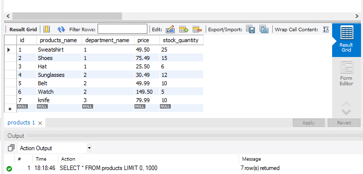
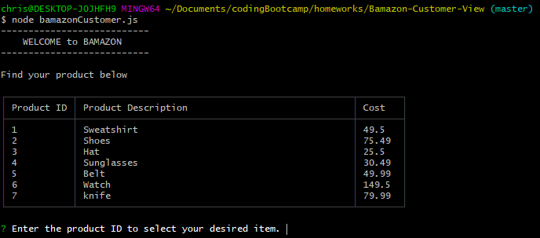
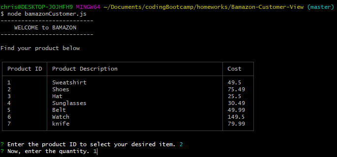
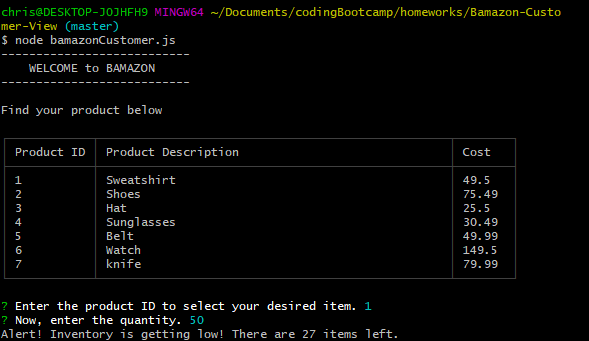

# Bamazon-Customer-View
Node.js &amp; MySQL

The Bamazon-Customer-View application allows the user to view a selection of 7 products within their computers command line. They will be prompted to select the product by it's corresponding ID. Once the ID has been entered, the user will then be prompted to choose the quantity of the selected item. If the desired quantity is available within the inventory, the user will be alerted that they have purchased the item. The order will be processed and ad the customer will be thanked for thier purchase. If quantity is low, they will be alerted as well as well as if the entered item does not exist. 

 - View of mySql database table
 

1. Enter the product ID to select your desired item.

2. Now, enter the quantity. (of that selected item)

3. Customer will then be prompted if inventory is positive and the order can be processed.

4. If inventory is getting low, the customer will also receive a prompt.

